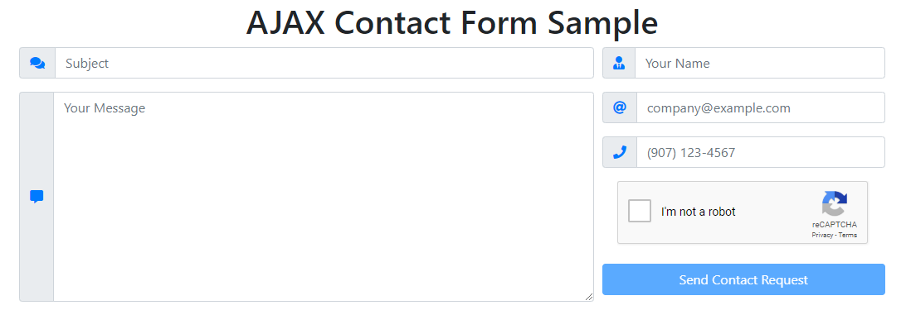
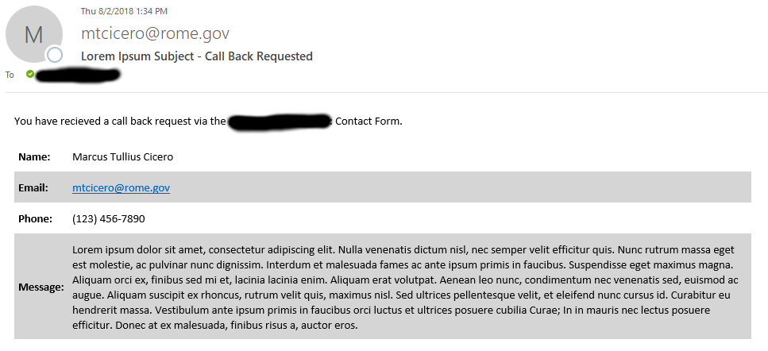

Recently, at my software development internship I was tasked to redo our company webpage including a new design.
It is a static website that also includes a contact form which will send an email through PHP's mail function to our company.
I did not like the old contact form, as it did not give the user any feedback whether the email has been sent successfully or not.
That's why I tried to make it better while I already redo the whole webpage. Here is my try at it:

First things first, we will need to write the skeleton of our form in HTML. Here is a sample:

**Note:** You will need to manually go to [Google Recaptcha]'s website and register your site with recaptcha and then paste your site key in line 68 of my sample code, where I wrote "YOUR SITE KEY".

This is how the contact form will look like:

Before the user passed the recaptcha the submit button is disabled. Here is the code that triggers when the recaptcha is passed. Paste it into contact-form.js in the folder js at the root of your webpage.


/\*

- For google recaptcha
  \*/
  function recaptchaCallback() {
  \$("#submit").prop('disabled', false);
  }
  

To make the phone number input easier for the user, I wrote a short jQuery function (line 3-27 in the code chunk below) to automatically surround the are code in parentheses and add a dash at the appropriate place.

Next we will need to write our AJAX code so work as a intermediate layer between our html site and our PHP code.
You can see my AJAX code in the code below from line 29 -76. Read the inline comments to see what each part of the code does.

The AJAX code communicates with the PHP code and displays an error message or a success message without reoading the page or redirecting to a success/error page.

In another file called process-contact.php at the root of your webpage paste this code:

**Note:** You will need to paste your site secret from your Google Recaptcha registration into line 4 where I wrote "YOUR SITE SECRET". Also you should specify your email at line 26.

If you did everything right, the resulting email will look like this:

[google recaptcha]: https://www.google.com/recaptcha/intro/v3beta.html
