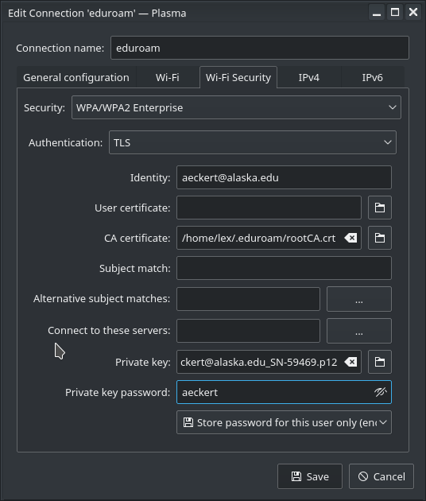
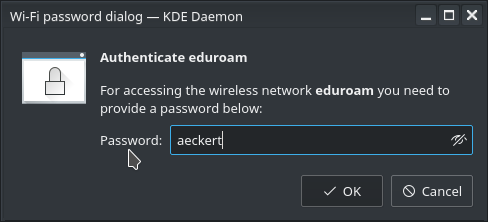

If you are running a Linux distribution with the KDE environment, then this should be pretty easy to follow in order to set up eduroam on your machine. The network manager interface for other Linux window managers (like Ubuntu Unity, xfce4, etc) should be pretty similar. Even the setup process for an Android phone is very similar.

First you will need to login to [radius.alaska.edu/eduroam][eduroam_login] and download the **CRT** and **PKCS12** under the advanced option. Save those files in a folder that you can locate later on. I usually save them in **~/.eduroam**.

Now select the eduroam network from the network manager and apply the following settings. Security should be **WPA/WPA2 Enterprise**, authentication **TLS** and identity should be your university provided email-address, generally _username_@alaska.edu. There is no user certificate needed. As your CA certificate select the **CRT** file that you downloaded earlier and your private key should be the **PKCS12** that you downloaded earlier as well. Your **password** for the private key should be your _UA username_. See the following picture for configuration:

KDE has the weird habit asking me a second time in a separate window for my private key password. I have not seen the Unity or xfce4 network manager do this, but in case you are asked, simply type in another time your _UA username_.

It should connect within 10 seconds, if it times out or takes longer than that, then please verify that you applied the above configuration.

**Note:** Your eduroam configuration will expire once a year and you will need to re-do this setup.

[eduroam_login]: https://radius.alaska.edu/eduroam/
