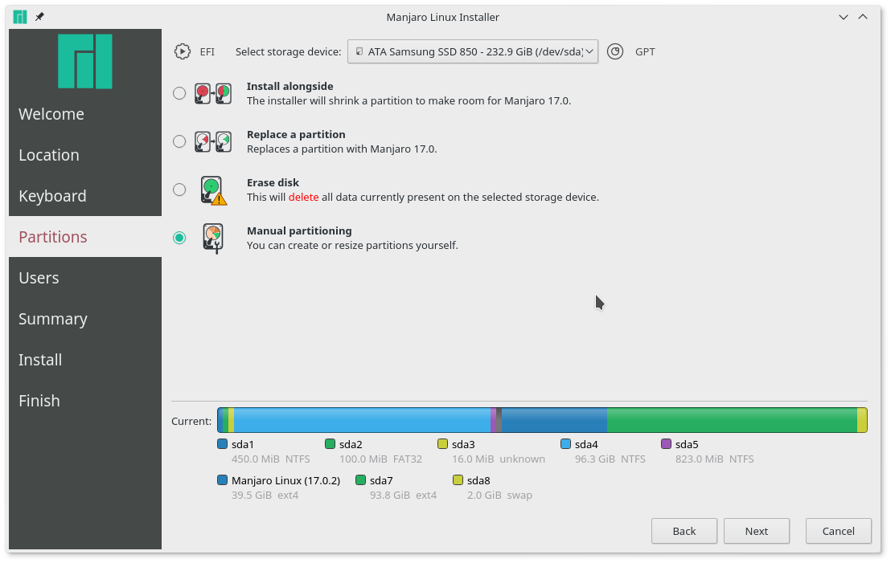
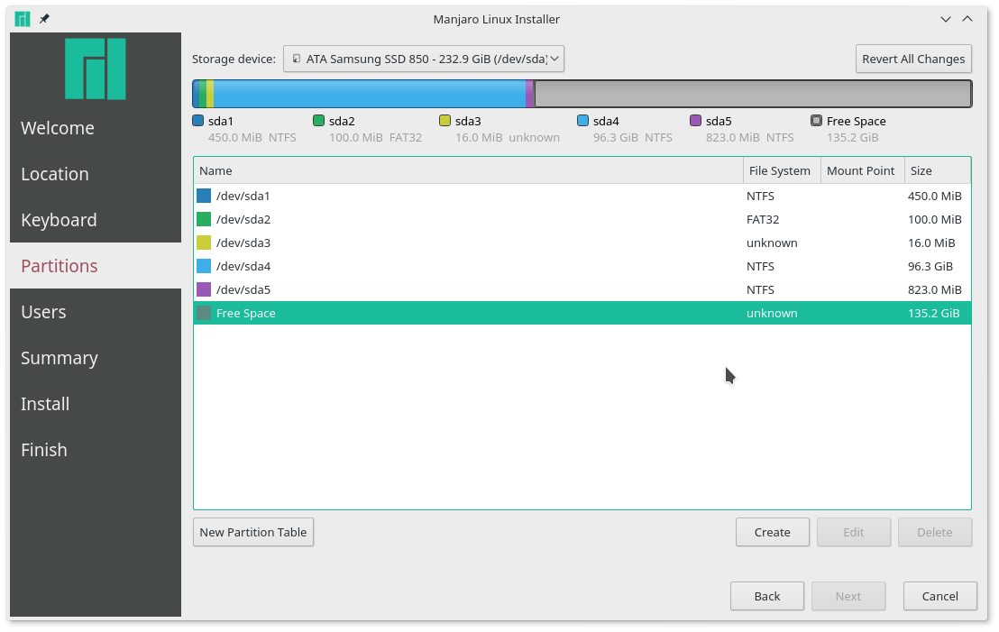
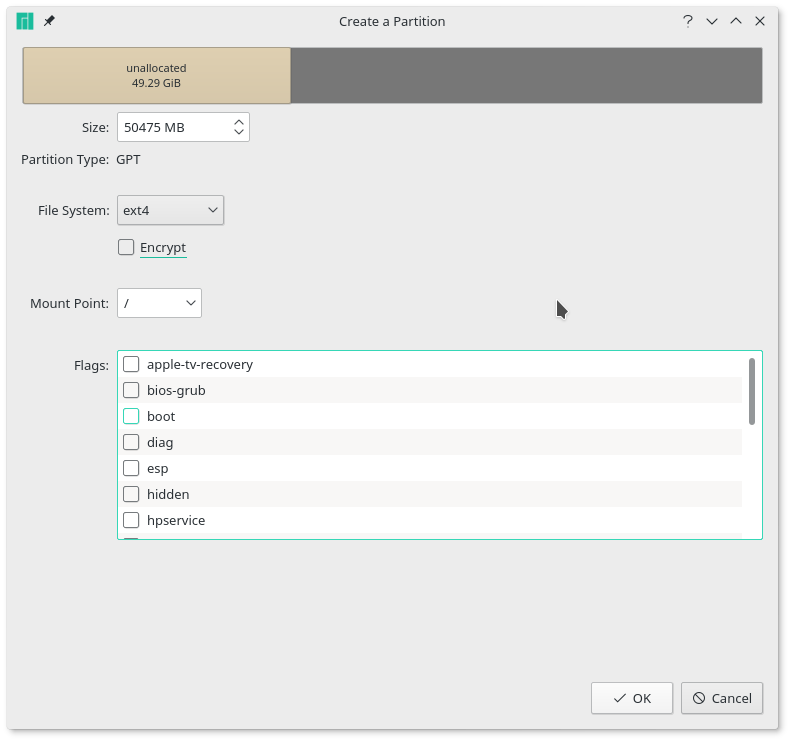
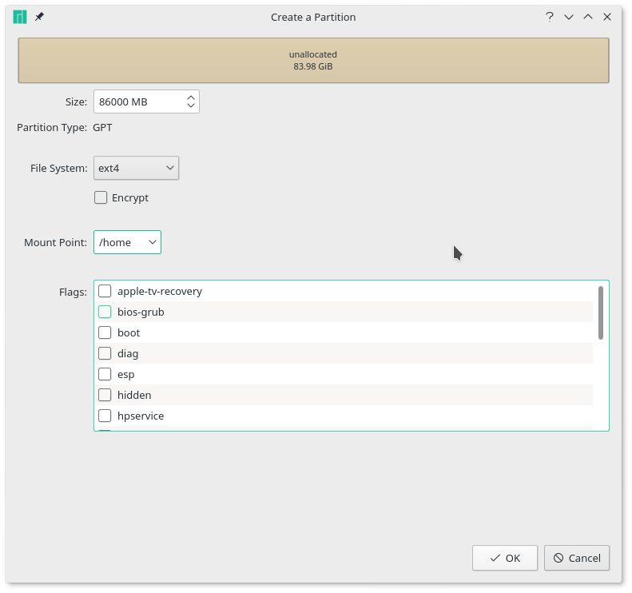
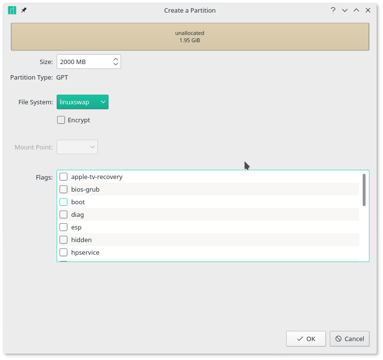
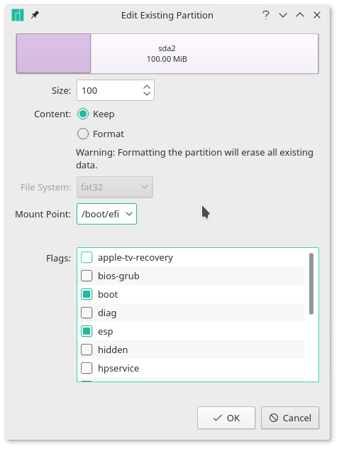
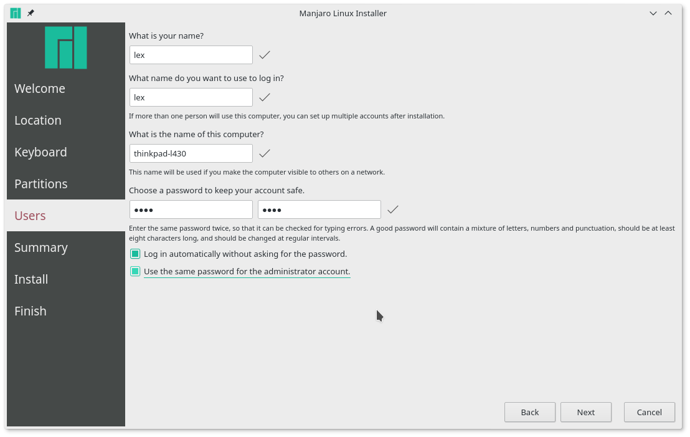

On my personal machine I like to use Manjaro as my primary operating system, but sometimes having Windows ready can be very useful. I mainly use it to watch Netflix, play games, or try out some Windows programs. I will describe in the following post how I configured my Laptop to dualboot Manjaro and Windows 10 Education.

First you will need to install Windows 10 in GPT UEFI mode and leave some space for Manjaro on the hard drive. That can be anywhere upwards from 20GB. The average base install of Manjaro is only about 7GB. Since, I use it as my main OS, I installed Windows 10 on 100GB of my 256GB SSD and dedicated the rest to Manjaro.  
Next download [Manjaro][manjaro] and create a bootable USB with [Rufus][rufus]. I chose the Manjaro KDE Edition (17.0.2). Configure Rufus to create a GPT UEFI bootable USB drive and shutdown you PC.  
Before you try booting into the Manjaro Live USB, make sure that your BIOS or UEFI setup is configured to boot from external media. Also turn off the secure boot. Once you successfully booted Manjaro from the USB, select to install Manjaro. Follow through the first steps configuring your keyboard and region. Under _Partitions_ choose **Manual Partitioning**.

Now you should be presented with the following screen:

We have to create three partitions, root, home, and swap. First we create the root partition. Select the _Free Space_ and hit the _create_ button.

The only options we need to specify for all three partitions are **File Size**, **File System** and **Mount Point**. Specify the size. That should be around 20GB at least, but can be less. I chose ~50GB, or 50470MB. File system should be **ext4** and Mount Point **/**.  
Next we create the home partition:

Here, I specified size to be 2GB less than what I have left of my free space. Those remaining 2GB I will dedicate to my swap partition. File system should be **ext4** and mount point **/home**.  
The last partition we create is swap:

File size should be those remaining 2GB and file system is **linuxswap**.  
Before we continue, we will have to do one more thing. We have to tell the system where to install **GRUB** the linux bootloader. We will install GRUB on the same partition as the Windows Bootloader is installed. Generally, that is partition 2, or _/dev/sdb2_. It is known as the _EFI System Partition_.  
Select partition 2 and hit **Edit**. All you need to do is specify the Mount Point as **/boot/efi**.

Now, we can continue. The next screen ask you for user information. Specify your username, computer name, and password. I applied the following configuration:

Click **Next** and you will see a summary of all changes to be made. Double check that everything is to your liking and then click **Next**.

Once the installation has successfully completed, booting into your new dualboot system will only allow you to boot into Manjaro at this point. Don't worry, we will fix that in a second. After Manjaro fully booted, open the terminal and run the following command:


sudo update-grub && reboot


Now, when you start your computer you should be able to select in the GRUB bootloader between Manjaro and Windows 10 and your dualboo system should be fully functional from this point!

[manjaro]: https://manjaro.org/get-manjaro/
[rufus]: https://rufus.akeo.ie
