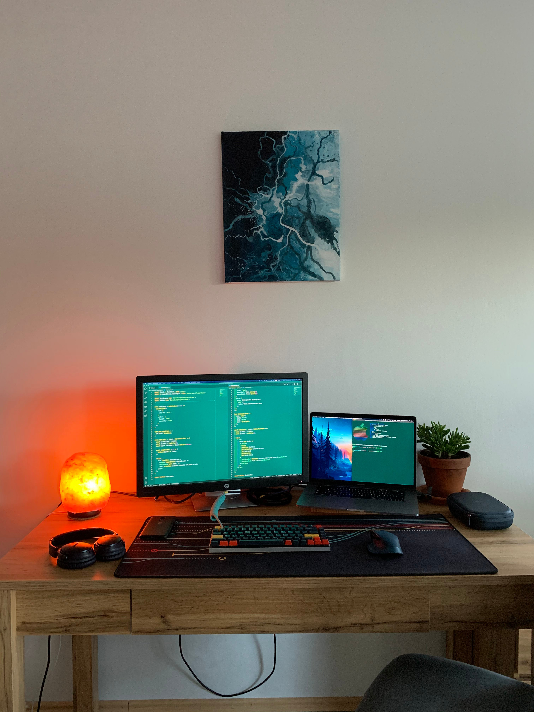

### Content

- [Hardware](#hardware)
  - [Smart Phone](#smart-phone)
  - [Laptop](#laptop)
  - [Keyboard](#keyboard)
  - [Mouse](#mouse)
  - [Headphones](#headphones)
- [Software](#software)
  - [Operating System](#operating-system)
  - [Font](#font)
  - [Notes](#notes)
  - [Email](#email)
  - [Password Manager](#password-manager)
  - [Browser](#browser)
  - [Editor](#editor)
  - [Terminal](#terminal)

### Hardware

#### Smart Phone
  - At work: Apple [**iPhone 8 Plus**](https://www.apple.com/) Space Grey
  - At home: [**OnePlus 6T**](https://www.oneplus.com/) Midnight Black

#### Laptop
  - At work: Apple [**MacBook Pro**](https://www.apple.com/) (15 inch, 2016)
  - At home: Lenovo [**ThinkPad Carbon x1**](https://www.lenovo.com/) (4th Gen)

#### Keyboard
  - Vortex [**Race 3**](http://www.vortexgear.tw/vortex2_2.asp?kind=47&kind2=225&kind3=&kind4=1044)
    - Switches: **Cherry MX Brown**
    - Keycaps: **Metropolis GMK**

#### Mouse
  - Logitech [**MX Master 2s**](https://www.logitech.com/) Midnight Blue

#### Headphones
  - Bose [**QuietComfort 35 II wireless**](https://www.bose.com) Midnight Blue

### Software

#### Operating System
  - At Work: Apple [**MacOS**](https://www.apple.com/de/macos/)
  - At Home: Dual Booting [**Windows 10 Pro**](https://www.microsoft.com/de-de/windows/get-windows-10) and [**Manjaro KDE Plasma Edition**](https://manjaro.org/download/#kde-plasma)

#### Font
  - [**Dank Mono**](https://dank.sh)

#### Notes
  - [**Notion**](https://www.notion.so/)

#### Email
  - [**Protonmail.com**](https://protonmail.com/) is my first choice, though I also have a Gmail and Hotmail account.

#### Password Manager
  - [**Bitwarden**](https://bitwarden.com/)

#### Browser
  - [**Firefox Developer Edition**](https://www.mozilla.org/de/firefox/developer/) with my [**Borealis Theme**](https://github.com/eckertalex/borealis-firefox)
    - Search Engine: DuckDuckGo with my [**Borealis Theme**](https://github.com/eckertalex/borealis-duckduckgo)
    - Extensions:
      - Bitwarden
      - Clear Cache
      - ColorZilla
      - Decentraleyes
      - DuckDuckGo Privacy Essentials
      - Facebook Container
      - HTTPS Everywhere
      - Iridium for YouTube
      - OctoLinker
      - Octotree
      - Pesticide, for Firefox
      - Privacy Badger
      - Privacy Settings
      - React Developer Tools
      - Redux DevTools
      - uBlock Origin
      - Wappalyzer
      - WhatFont

#### Editor
  - [**Visual Studio Code**](https://code.visualstudio.com/insiders/) - See my [VSCode Configuration](./vscode)

#### Terminal
  - [**Kitty**](https://sw.kovidgoyal.net/kitty/)
    - Theme: [**Borealis Theme for Kitty**](https://github.com/eckertalex/borealis-kitty)
    - Prompt: [**spaceship**](https://github.com/denysdovhan/spaceship-prompt)
    - Shell: [**zsh with Oh My Zsh**](https://ohmyz.sh/)
      - CLIs
        - [git](https://git-scm.com/) - See my [git aliases](./gitaliases)
        - [gh](https://cli.github.com/) - Official GitHub CLI tool
        - [bat](https://github.com/sharkdp/bat) - a better cat
        - [delta](https://github.com/dandavison/delta) - a better git diff
        - [ripgrep](https://github.com/BurntSushi/ripgrep) - a better grep 
        - [fnm](https://github.com/Schniz/fnm) - a node.js version manager 
        - [homebrew](https://brew.sh/) (on MacOS)
      - Extensions:
        - git
        - npm
        - colored-man-pages
        - colorize
        - brew
        - osx
        - common-aliases
        - history-substring-search
        - zsh-completions
        - zsh-autosuggestions
        - zsh-syntax-highlighting
        - you-should-use
        - thefuck
        - themes
        - vscode
        - wd
