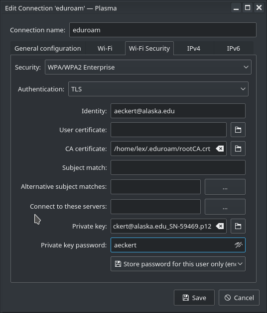
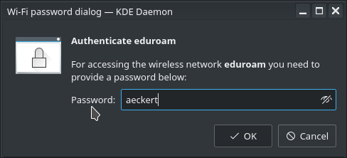

If you are running a Linux distribution with the KDE environment, then this
should be pretty easy to follow in order to set up eduroam on your machine. The
network manager interface for other Linux window managers (like Ubuntu Unity,
xfce4, lxde, etc) should be pretty similar. Even the setup process for an
Android phone is very similar.

First you will need to login to [radius.alaska.edu/eduroam][eduroam_login] and
download the **CRT** and **PKCS12** under the advanced option. Save those files
in a folder that you can locate later on. I usually save them in **~/.eduroam**.

Now select the eduroam network from the network manager and apply the following
settings:

- Security: **WPA/WPA2 Enterprise**
- Authentication: **TLS**
- Identity: **\<username\>@alaska.edu** (should be your university provided
  email-address)
- User certificate: **leave empty**
- CA certificate: **CRT** file that you downloaded earlier
- Private key: **PKCS12** file that you downloaded earlier as well
- **Password**: **\<UA-username\>** (for the private key)

See the following picture for configuration:

KDE has the weird habit asking me a second time in a separate window for my
private key password. I have not seen the Unity or xfce4 network manager do
this, but in case you are asked, simply type in another time your
**\<UA-username\>**.

It should connect within 10 seconds, if it times out or takes longer than that,
then please verify that you applied the above configuration correctly.

**Note:** Your eduroam configuration will expire once a year, and you will need
to re-do this setup.

[eduroam_login]: https://radius.alaska.edu/eduroam/
